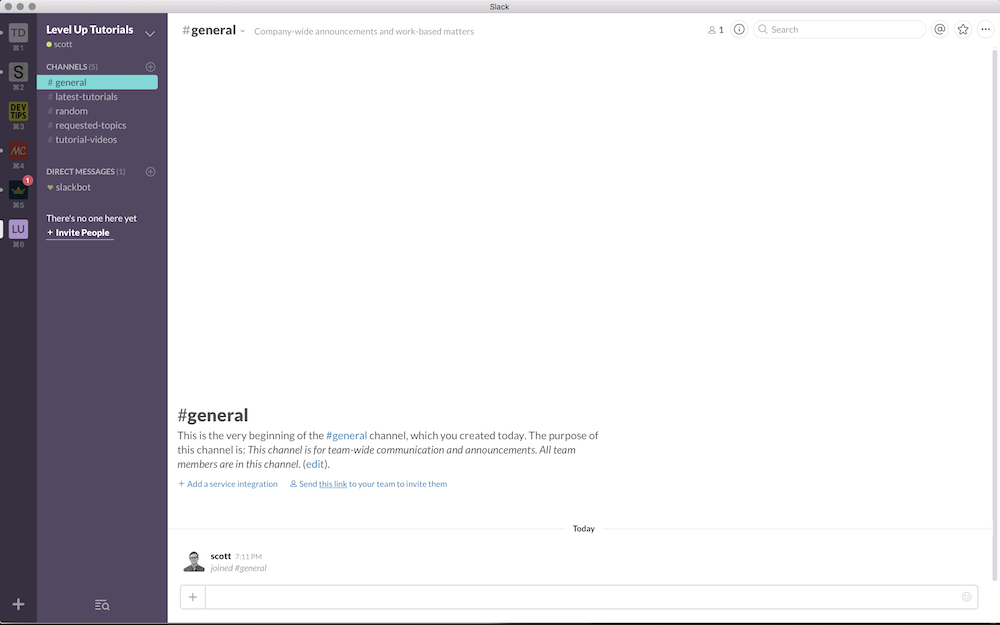
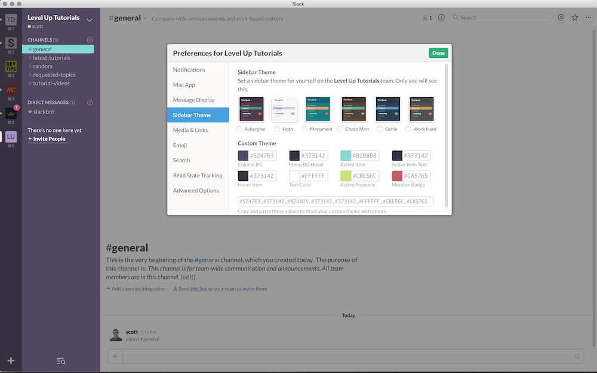

# Level Up Tutorials Slack Theme



Go To Room Name > Preferences > Sidebar Theme and past the following into the long input box.

```
#524763,#373142,#82D8D8,#373142,#373142,#FFFFFF,#CBE56C,#CA5765
```


